# Patient Management UML

Markdown note synchronized: 2026-06-16.

The Mermaid diagram block was not resynchronized in this documentation pass. It still needs a separate diagram update for the current `CurrentSession`, `CurrentUser`, `MenuController`, `MenuFlow`, `AdminMenu`, `LocalAdminMenu`, and `CollectLoginValues` structure.

This diagram shows the architecture and the most important placeholders in Patient Management System V5.01. The raw Mermaid source is maintained in `patient-management-uml.mmd`.

The diagram still reflects the earlier architecture slice:

- Controller-driven configuration and authentication
- Registration, login, password, recovery, and pending-user flows
- JDBC repository relationships
- Persisted failed-login status policy
- Partial SLF4J and Logback migration
- Earlier placeholders and known recovery/access boundaries

```mermaid
classDiagram
  %% Patient Management System V5.01
  %% Last synchronized: 2026-06-07

  direction LR

  namespace BootstrapAndControllers {
    class Main {
      +main(args) void
    }
    class BootConfigService {
      +displayLoader() void
      +SystemConfig(scanner) void
    }
    class FrontController {
      +navigateSubController(request, scanner) boolean
    }
    class RequestType {
      <<enumeration>>
      CONFIG
      AUTH
      MENU
      SERVICE
      UI
      EXIT
    }
    class ConfigController {
      +execute(scanner) boolean
    }
    class AuthController {
      +verifyAccountStatus(scanner) void
    }
    class MenuController {
      <<placeholder>>
    }
    class ServiceController {
      <<placeholder>>
    }
    class uiController {
      <<placeholder>>
    }
  }

  namespace Configuration {
    class EnvValidationService {
      +envStatus() boolean
      +getHost() String
      +getPort() int
      +getDBName() String
      +getUser() String
      +getPassword() String
    }
    class SQLValidationService {
      +DBConnection() boolean
      +getSQLUser() String
      +getSqlPWSD() String
      +getSqlURL() String
    }
    class DBManager {
      <<utility>>
      +initialize(user, password, url) boolean
      +getConnection() Connection
    }
    class HandleRecoveryKey {
      +plainKey() void
      +hashedKey() void
      +getRecoveryKeyHashed() String
    }
    class LogManager {
      <<utility>>
      +log(type, message) void
    }
    class LogType {
      <<enumeration>>
    }
  }

  namespace AuthenticationFlows {
    class RegistrationFlow {
      +user(scanner) void
    }
    class LoginFlow {
      +user(scanner) void
    }
    class PasswordFlow {
      +policy(scanner) String
    }
    class RecoveryFlow {
      +SystemAccounts(scanner) void
    }
  }

  namespace AuthenticationServices {
    class RegistrationService {
      +userAccunt(scanner) void
      +getUserName() String
      +getEmailAddress() String
      +getPhoneNumber() String
      +getHashedPWSD() String
    }
    class PasswordService {
      +userPWSD(scanner) void
      +plainPWSD() void
      +getHashedPWSD() String
    }
    class LoginInputCollector {
      +user(scanner) void
      +getEnteredUserName() String
      +getEnteredPWSD() String
    }
    class LoginVerification {
      +loggedUser(username, password, scanner) AuthLogResult
    }
    class AuthLogResult {
      +isSuccess() boolean
      +getFailureReason() String
    }
    class FirstLogin {
      +firstSetup(username, scanner) void
    }
    class CollectUserDepartment {
      +department(scanner) void
      +getSelectedDepartment() int
    }
    class CollectUserJob {
      <<placeholder>>
    }
    class CollectUserRole {
      +requestRoles(scanner) void
    }
    class AccountPolicy {
      <<placeholder>>
    }
    class ValidateRecoveryKey {
      +keyValues(scanner) void
      +getEnteredHashByUser() String
    }
    class CheckKeyStatus {
      +Value(enteredKey, storedHash) boolean
    }
    class SelectUserForRecovery {
      +username(scanner) String
      +getRecoverUsername() String
    }
  }

  namespace Repositories {
    class CheckForDefaultAccounts {
      +dbAccounts() boolean
      +validateResults() boolean
    }
    class CreateDefaultAccounts {
      +defaultAccounts(createLocalAdmin, createAdmin) boolean
    }
    class SetRecoveryKey {
      +keyValue(recoveryKey) void
    }
    class CreateAccount {
      +newAccount(username, email, phone, hash) void
    }
    class CheckUserInDB {
      +checkUserInDB(username) boolean
      +checkPWSD(password, username) boolean
      +checkUserStatus(username) String
    }
    class LoginAttemptRepository {
      +loginAttempts(username, success, reason) void
    }
    class CountFailedLoginAttempts {
      +Logs(username) int
    }
    class ExecutePWSDPolicy {
      +locked(username) void
      +suspicious(username) void
      +quarantine(username) void
    }
    class UpdateUserPassword {
      +dbValues(username, hash) boolean
    }
    class CreateAccessRequest {
      +accessManagement(username, department) void
    }
    class HasAssignedDepartment {
      +status(username) boolean
    }
    class GetRecoveryKeyHash {
      +key() void
      +getDbValue() String
    }
    class FindRecoverableUser {
      +systemAccounts() void
    }
    class SelectUserForRecover {
      +inDB(username) boolean
    }
    class UpdateSystemAccountPassword {
      +sqlQuerry(username, password) void
    }
    class SetNewStatus {
      <<placeholder>>
    }
  }

  namespace MenusAndExternal {
    class AuthMenu
    class DepartmentMenu
    class DepartmentJobMenus
    class roleMenu
    class Scanner {
      <<java.util>>
    }
    class Console {
      <<java.io>>
    }
    class Dotenv {
      <<dotenv-java>>
    }
    class BCrypt {
      <<jbcrypt>>
    }
    class SLF4J {
      <<logging API>>
    }
    class Logback {
      <<logging backend>>
    }
    class MySQL {
      <<database>>
    }
  }

  Main ..> BootConfigService : starts
  Main ..> Scanner : creates
  BootConfigService ..> FrontController : creates
  BootConfigService ..> AuthController : creates
  BootConfigService ..> ConfigController : creates
  BootConfigService ..> MenuController : creates
  BootConfigService ..> ServiceController : creates
  BootConfigService ..> uiController : creates
  FrontController ..> RequestType : routes CONFIG and AUTH
  FrontController *-- ConfigController
  FrontController *-- AuthController

  ConfigController ..> EnvValidationService
  ConfigController ..> SQLValidationService
  ConfigController ..> DBManager
  ConfigController ..> HandleRecoveryKey
  ConfigController ..> SetRecoveryKey
  ConfigController ..> CheckForDefaultAccounts
  EnvValidationService ..> Dotenv
  SQLValidationService ..> MySQL : validates connection
  DBManager ..> MySQL : opens connections
  HandleRecoveryKey ..> Dotenv
  HandleRecoveryKey ..> BCrypt : hashes key
  CheckForDefaultAccounts ..> CreateDefaultAccounts

  AuthController ..> AuthMenu
  AuthController ..> RegistrationFlow
  AuthController ..> LoginFlow
  AuthController ..> RecoveryFlow

  RegistrationFlow ..> RegistrationService
  RegistrationFlow ..> CreateAccount
  RegistrationService ..> PasswordFlow
  PasswordFlow ..> PasswordService
  PasswordService ..> Console
  PasswordService ..> BCrypt

  LoginFlow ..> LoginInputCollector
  LoginFlow ..> LoginVerification
  LoginFlow ..> LoginAttemptRepository
  LoginInputCollector ..> Console
  LoginVerification ..> AuthLogResult
  LoginVerification *-- CheckUserInDB
  LoginVerification ..> FirstLogin
  LoginVerification ..> PasswordService
  LoginVerification ..> UpdateUserPassword
  LoginVerification ..> CountFailedLoginAttempts
  LoginVerification ..> ExecutePWSDPolicy
  CheckUserInDB ..> BCrypt

  FirstLogin ..> DepartmentMenu
  FirstLogin ..> CollectUserDepartment
  FirstLogin ..> DepartmentJobMenus
  FirstLogin ..> HasAssignedDepartment
  FirstLogin ..> CreateAccessRequest
  CollectUserRole ..> roleMenu

  RecoveryFlow ..> ValidateRecoveryKey
  RecoveryFlow ..> GetRecoveryKeyHash
  RecoveryFlow ..> CheckKeyStatus
  RecoveryFlow ..> SelectUserForRecovery
  RecoveryFlow ..> SelectUserForRecover
  RecoveryFlow ..> PasswordService
  RecoveryFlow ..> UpdateSystemAccountPassword
  ValidateRecoveryKey ..> Console
  CheckKeyStatus ..> BCrypt
  CheckKeyStatus ..> FindRecoverableUser

  LogManager ..> LogType
  LogManager ..> SLF4J
  SLF4J ..> Logback

  SetRecoveryKey ..> DBManager
  CreateDefaultAccounts ..> DBManager
  CreateAccount ..> DBManager
  CheckUserInDB ..> DBManager
  LoginAttemptRepository ..> DBManager
  CountFailedLoginAttempts ..> DBManager
  ExecutePWSDPolicy ..> DBManager
  UpdateUserPassword ..> DBManager
  CreateAccessRequest ..> DBManager
  GetRecoveryKeyHash ..> DBManager
  FindRecoverableUser ..> DBManager
  SelectUserForRecover ..> DBManager
  UpdateSystemAccountPassword ..> DBManager

  note for FrontController "Only CONFIG and AUTH are routed."
  note for LoginAttemptRepository "Source class: app.Repository.logsRepository.CollectLogs"
  note for AuthLogResult "Source class: app.Auth.Flow.Services.AuthSecurityService.Audit.CollectLogs"
  note for ExecutePWSDPolicy "Persists locked, suspicious, and quarantine status IDs."
  note for CreateAccessRequest "Stores selected department with default job and role."
  note for LogManager "Logging migration is partial and no logback.xml exists."
  note for SelectUserForRecover "Final lookup currently accepts any existing account."
```

## Diagram Boundaries

- The diagram groups the many CLI message and department-job menu classes.
- Database tables are represented by the MySQL dependency rather than individual table classes.
- `AuthLogResult` and `LoginAttemptRepository` are aliases used to distinguish two source classes both named `CollectLogs`.
